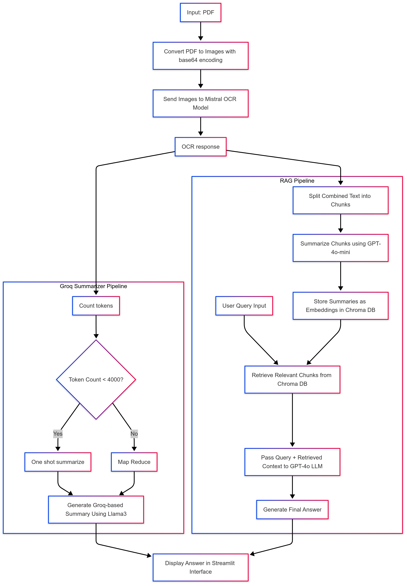

# The Gift of the Magi - PDF Analysis

A Streamlit application for analyzing "The Gift of the Magi" PDF using OCR, summarization, and RAG (Retrieval-Augmented Generation).

## Overview

This application processes a PDF of "The Gift of the Magi" by O. Henry, extracts text using OCR, and provides two main functionalities:
1. Generate a comprehensive summary of the story
2. Answer questions about the story using a RAG (Retrieval-Augmented Generation) system

## Features

- PDF processing with OCR (Optical Character Recognition)
- Text summarization
- Question answering using RAG
- Interactive web interface built with Streamlit

## Technical Stack

- **Frontend**: Streamlit
- **PDF Processing**: PyMuPDF
- **OCR**: Mistral OCR API
- **Vector Database**: ChromaDB
- **LLMs**:
  - OpenAI GPT-4o and GPT-4o-mini for text summarization and RAG
  - Llama3-70b-8192 (via Groq) for comprehensive summarization
- **Embedding Model**: OpenAI text-embedding-ada-002
- **Text Processing**: LangChain

## Architecture


NOTE: Have not tested map reduce

## Implementation Approach

1. **PDF Processing Pipeline**:
   - Convert PDF pages to images using PyMuPDF
   - Process images with Mistral OCR to extract text
   - Combine extracted text from all pages

2. **Summarization**:
   - Use Llama3-70b-8192 via Groq API to generate a comprehensive summary
   - Implement with LangChain for document processing

3. **RAG System**:
   - Split text into chunks and generate summaries using GPT-4o-mini for each chunk as the vocabulary makes the story hard to understand from small chunks
   - Create embeddings using OpenAI's embedding model
   - Store in ChromaDB vector database
   - Retrieve relevant context based on similarity to user queries
   - Generate answers using GPT-4o with retrieved context

## Setup

1. Clone this repository
2. Install the required dependencies:
   ```
   pip install -r requirements.txt
   ```
3. Create a `.env` file in the root directory with the following API keys:
   ```
   OPENAI_API_KEY=your_openai_api_key
   MISTRAL_API_KEY=your_mistral_api_key
   GROQ_API_KEY=your_groq_api_key
   ```

## Required Dependencies

```
streamlit
python-dotenv
pymupdf
pillow
mistralai
openai
chromadb
langchain
langchain-core
```

## Usage

1. Ensure you have the PDF file "The_Gift_of_the_Magi.pdf" in the root directory
2. Run the Streamlit app:
   ```
   streamlit run streamlit_app.py
   ```
3. Open your browser and navigate to the URL shown in the terminal (usually http://localhost:8501)
4. Choose an option from the sidebar:
   - **Summary**: Generate a comprehensive summary of the story
   - **Ask Questions (RAG)**: Ask specific questions about the story

## File Structure

- `streamlit_app.py`: Main Streamlit application
- `preprocess.py`: PDF preprocessing and image conversion
- `ocr.py`: OCR module using Mistral API
- `rag.py`: RAG implementation for question answering
- `summarize.py`: Text summarization using Llama3
- `The_Gift_of_the_Magi.pdf`: The PDF file to analyze

## Implementation Challenges

1. **OCR Quality**: Ensuring high-quality text extraction from PDF pages required testing with different models.

2. **Retrieval & Indexing**: Had to try different embedding models and different stratergies for efficient retreival of relevant context. Had to try different chunking stratergies to get the best responses.

3. **Performance Optimization**: Implementing caching with Streamlit's `@st.cache_data` and `@st.cache_resource` to avoid redundant processing.

## Future Improvements

- Support for uploading custom PDFs, pdf urls, image urls
- Improved error handling and retry mechanisms for API calls
- Implement better methods to handle longer text
- Try populating a knowledge graph to provide better context